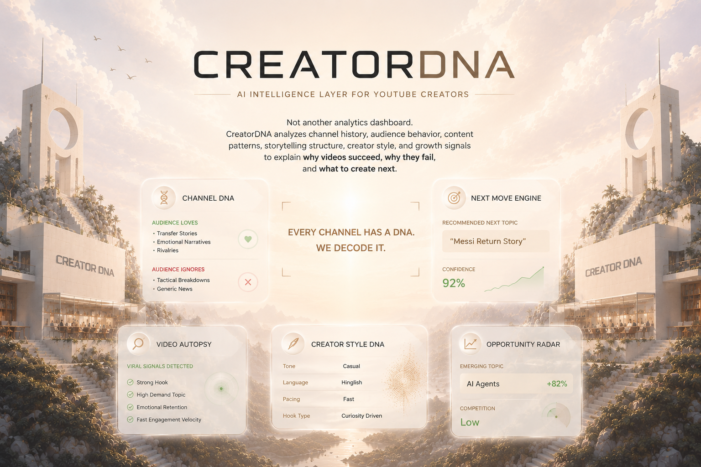

<div align="center">
  
  
  <br />
  
  <h1>🧬 Creator DNA</h1>
  <h3>The Complete Creators Intelligence Platform for YouTube</h3>

  <p align="center">
    <b>Decode algorithms, trace viral patterns, detect trends, and secure views in real time.</b>
  </p>

  <p align="center">
    <a href="https://nextjs.org/"></a>
    <a href="https://www.python.org/"></a>
    <a href="https://gemini.google.com/"></a>
  </p>
</div>


## 🚀 Overview

**Creator DNA** is a cutting-edge intelligence lab built exclusively for YouTube creators. Moving beyond basic analytics, it acts as your personal algorithm decoder, providing forensic-level insights into viewer behavior, video performance, and recommendation engines.

Powered by advanced data pipelines and **Google Gemini**, Creator DNA empowers creators to stop guessing and start reverse-engineering success.

---

## ✨ Core Intelligence Modules

### 🔍 1. Decoding Algorithms
*Real-time YouTube recommendation engine decoding.*
Analyze how the algorithm perceives your content and precisely what triggers it to push your videos to a broader audience.

### 🧬 2. Map Audience DNA
*Deep demographics and cross-channel viewing habits.*
Understand exactly who is watching, what else they watch, and the specific niche clusters your content appeals to.

### 📈 3. Forecast Retention
*Pinpoint exact audience drop-off moments before publishing.*
Using predictive AI, simulate video retention graphs and identify high-risk drop-off zones during the editing phase.

### 🔬 4. Video Autopsy
Deep-dive post-mortems on why a specific video underperformed or went viral.

---

## 💻 Tech Stack Architecture

The platform is divided into two highly optimized environments:

### Frontend (`/frontend`)
- **Framework:** Next.js (App Router)
- **Language:** TypeScript
- **Styling:** CSS Modules with Glassmorphism & High-Performance Micro-animations
- **Optimization:** Edge-optimized with native `next/image` and smart preloading.

### Backend (`/backend`)
- **Language:** Python 3.x
- **Database:** SQLite (`creator_dna.db`)
- **APIs:** Custom REST endpoints serving real-time analytics and waitlist data.

---

## 🛠️ Getting Started

### Prerequisites
- Node.js 18.x or higher
- Python 3.9+

### 1. Start the Backend
Navigate to the backend directory and set up your Python environment:
```bash
cd backend
python3 -m venv venv
source venv/bin/activate
pip install -r requirements.txt
# Start the server (e.g., Uvicorn/FastAPI or Flask)
python main.py
```

### 2. Start the Frontend
In a new terminal window, navigate to the frontend:
```bash
cd frontend
npm install
npm run dev
```
Your frontend will now be running on `http://localhost:3000` and securely proxying requests to your local Python backend!

---

## 🌌 UI / UX Philosophy

Creator DNA is designed with a **"Premium Sci-Fi / Lab"** aesthetic. 
- **Vast Depth:** Utilizing layered, fixed-attachment ultra-HD background scapes.
- **Glassmorphism:** Frosted glass panels ensure text legibility while maintaining environmental depth.
- **Micro-interactions:** Subtle delays, blurs, and hover states make the UI feel alive and highly responsive.

---

<div align="center">
  <i>"Don't chase the algorithm. Decode it."</i><br><br>
  Built with ❤️ for Creators.
</div>
